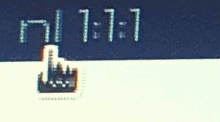

<h1 align="center">polybar-nightlight</h1>

<p>&nbsp;</p>

A gamma control/blue light filter module for your

<div align="center">
	<picture>
 	 <source media="(prefers-color-scheme: dark)" srcset="https://raw.githubusercontent.com/polybar/polybar/master/doc/_static/banner-dark-mode.png">
 	 
	</picture>
</div>

<p>&nbsp;</p>

<p align="center">
	<a href="https://github.com/jamessouth/polybar-nightlight/blob/master/LICENSE"></a>
	<a href="https://archlinux.org/"></a>
	<a href="https://www.gnu.org/software/bash/manual/"></a>
	<a href="https://www.x.org/wiki/"></a>
	
</p>
<p>&nbsp;</p>

## Description
This module provides a blue light filter/night shift effect for `X` displays. It:
* uses polybar's `ipc` function
* calls the `xrandr` command to change the gamma output
* does *not* depend on `redshift`
Wayland is not currently supported.


<p>&nbsp;</p>

## Installation
```bash
fn="$HOME/.config/polybar/nightlight.sh" && curl -o $fn https://raw.githubusercontent.com/jamessouth/polybar-nightlight/master/nightlight.sh && chmod +x $fn
```
This will:
* set the `fn` variable to `~.config/polybar/nightlight.sh`
* `curl` the script to that location
* `chmod +x` the script
<p>&nbsp;</p>

## Usage
Please see the wiki.
<p>&nbsp;</p>

